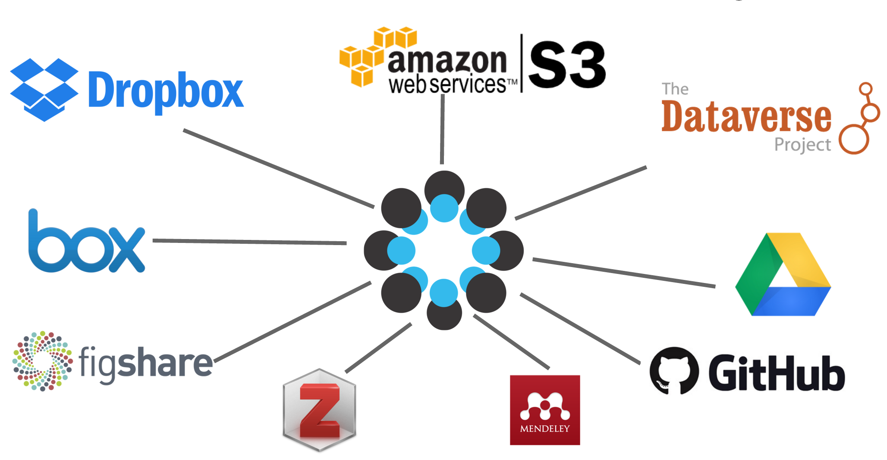
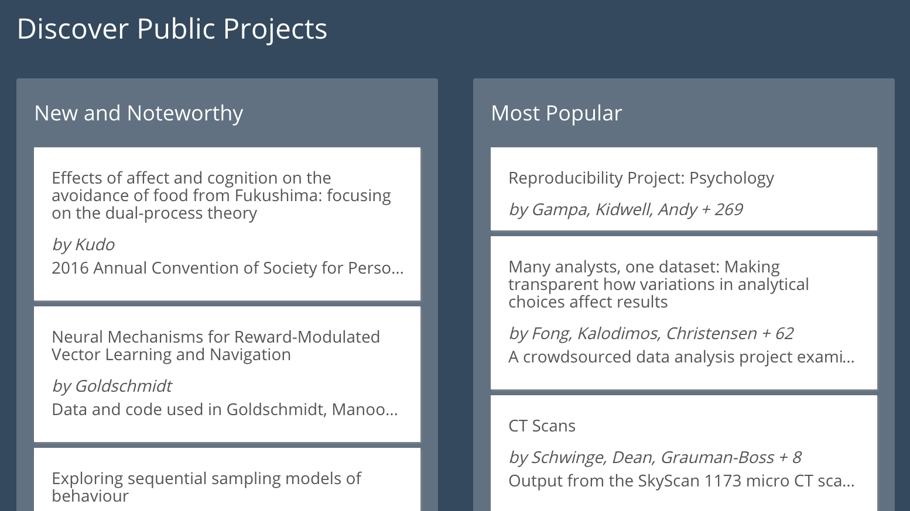

```{r setup, include=FALSE}
knitr::opts_chunk$set(echo = FALSE)
```

## What is the Open Science Framework? {.build}

Free, open-source software that manages projects at all stages of the research lifecycle and connects the tools researchers use.

## What is the Open Science Framework?

<div class="columns-2">


- Planning
- Execution
- Reporting
- Archiving
- Discovery

</div>

## Planning

- Creating a project
- Registering a research plan

## Execution



## Execution

- Hub for services
- Version control
- Collaboration
- Project management

## Reporting

- Anonymized, view-only links
- Unique, persistent URLs
- Commenting

## Archiving

- Preservation endowment
- Connections to repositories

## Discovery 



## Discovery

- Keywords and tags
- SHARE notification service
